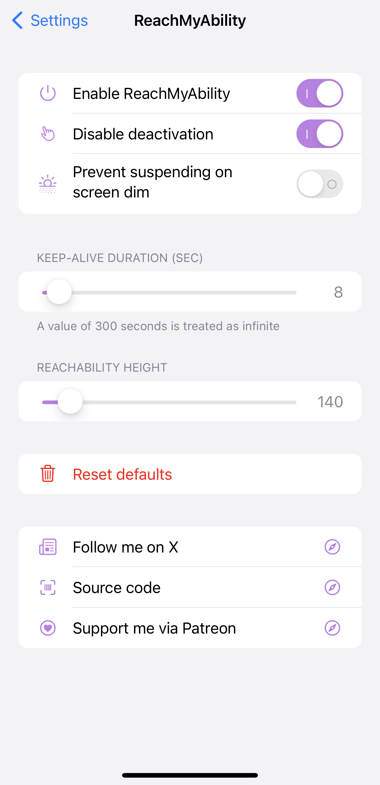
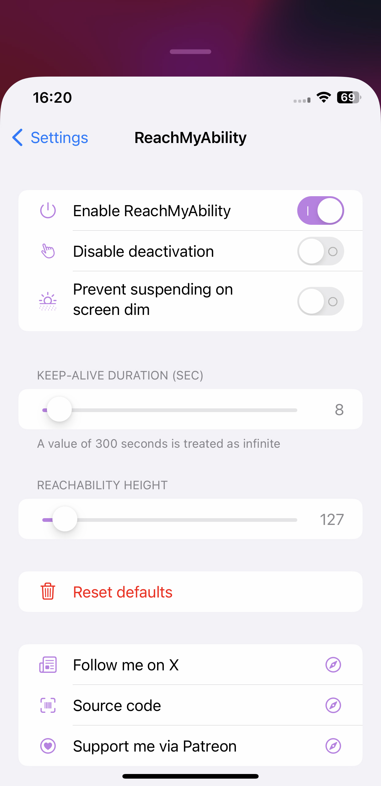
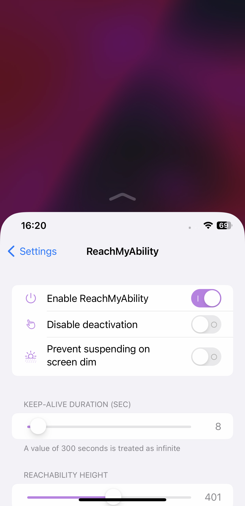

# ReachMyAbility
A Lightweight Reachability Manager for iOS

## Screenshots
<table>
   <tr>
      <td></td>
      <td></td>
      <td></td>
   </tr>
</table>

## Features:
  <li>Disable auto-deactivation</li>
  <li>Prevent suspending on screen dim</li>
  <li>Custom keep-alive duration</li>
  <li>Custom reachability height</li>

## How to build a ReachMyAbility using Github actions
> [!NOTE]
> If this your first time, complete following steps before starting:
>
> 1. Fork this repository using the fork button on the top right
> 2. On your forked repository, go to **Repository Settings** > **Actions**, enable **Read and Write** permissions.

<ol>
 <li>Click on <strong>Sync fork</strong>, and if your branch is out-of-date, click on <strong>Update branch</strong>.</li>
 <li>Navigate to the <strong>Actions tab</strong> in your forked repository and select <strong>Build ReachMyAbility</strong>.</li>
 <li>Click the <strong>Run workflow</strong> button located on the right side.</li>
 <li>Mark or unmark the tweaks arcs want to build.</li>
 <li>Click <strong>Run workflow</strong> to start the process.</li>
 <li>Wait for the build to finish. You can download the ReachMyAbility tweak from the releases section of your forked repo</li>
</ol>

 

**ReachMyAbility preferences can be found in the iOS Settings, does not require respring**
